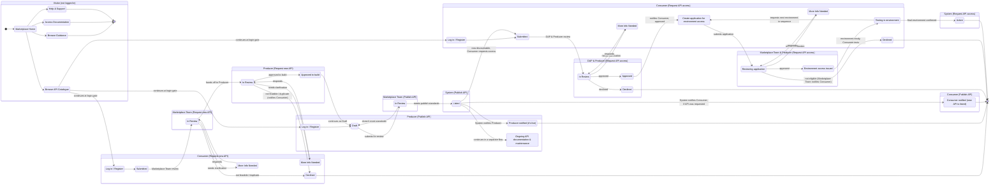

# API Marketplace Product Flows

```mermaid
stateDiagram-v2
    direction LR

    %% ===== Browse the Marketplace =====
    state "Visitor (not logged in)" as Visitor {
        [*] --> MarketplaceHome
        MarketplaceHome: Marketplace Home
        BrowseCatalogue: Browse API Catalogue
        BrowseGuidance: Browse Guidance
        AccessDocs: Access Documentation
        HelpSupport: Help & Support

        MarketplaceHome --> BrowseCatalogue
        MarketplaceHome --> BrowseGuidance
        MarketplaceHome --> AccessDocs
        MarketplaceHome --> HelpSupport

        BrowseGuidance --> [*]
        AccessDocs --> [*]
        HelpSupport --> [*]
    }

    %% ===== Request new API =====
    state "Consumer (Request new API)" as ReqNew_Consumer {
        LoginGateNew: Log in / Register
        SubmittedNew: Submitted
        MoreInfoNew1: More Info Needed
        MoreInfoNew2: More Info Needed
        DeclinedNew: Declined
    }

    state "Marketplace Team (Request new API)" as ReqNew_MT {
        InReviewNewMT: In Review
    }

    state "Producer (Request new API)" as ReqNew_Producer {
        InReviewNewProducer: In Review
        ApprovedToBuild: Approved to build
    }

    %% ===== Publish API =====
    state "Producer (Publish API)" as Publish_Producer {
        LoginGatePublish: Log in / Register
        Draft: Draft
        ProducerNotified: Producer notified (it's live)
        OngoingMaintenance: Ongoing API documentation & maintenance
    }

    state "Marketplace Team (Publish API)" as Publish_MT {
        InReviewPublish: In Review
    }

    state "System (Publish API)" as Publish_Sys {
        Listed: Listed
    }

    state "Consumer (Publish API)" as Publish_Consumer {
        ConsumerNotifiedListed: Consumer notified (new API is listed)
    }

    %% ===== Request API access =====
    state "Consumer (Request API access)" as ReqAccess_Consumer {
        LoginGateAccess: Log in / Register
        SubmittedAccess: Submitted
        MoreInfoAccess1: More Info Needed
        CreateApplication: Create application for environment access
        MoreInfoAccess2: More Info Needed
        DeclinedEnvApp: Declined
        TestingInEnvironment: Testing in environment
    }

    state "DAP & Producer (Request API access)" as ReqAccess_DAP {
        InReviewAccess: In Review
        ApprovedAccess: Approved
        DeclinedInitial: Declined
    }

    state "Marketplace Team & Producer (Request API access)" as ReqAccess_MTP {
        ReviewingApplication: Reviewing application
        EnvironmentAccessIssued: Environment access issued
    }

    state "System (Request API access)" as ReqAccess_Sys {
        Active: Active
    }

    %% ----- Request new API transitions -----
    LoginGateNew --> SubmittedNew
    SubmittedNew --> InReviewNewMT: Marketplace Team review
    InReviewNewMT --> MoreInfoNew1: needs clarification
    MoreInfoNew1 --> InReviewNewMT: responds
    InReviewNewMT --> InReviewNewProducer: hands off to Producer
    InReviewNewMT --> DeclinedNew: not feasible / duplicate
    InReviewNewProducer --> MoreInfoNew2: needs clarification
    MoreInfoNew2 --> InReviewNewProducer: responds
    InReviewNewProducer --> DeclinedNew: not feasible / duplicate (notifies Consumer)
    InReviewNewProducer --> ApprovedToBuild: approved to build
    DeclinedNew --> [*]

    %% ----- Publish API transitions -----
    LoginGatePublish --> Draft
    Draft --> InReviewPublish: submits for review
    InReviewPublish --> Draft: doesn't meet standards
    InReviewPublish --> Listed: meets publish standards
    Listed --> ProducerNotified: System notifies Producer
    ProducerNotified --> [*]
    Listed --> OngoingMaintenance: continues in a separate flow
    Listed --> ConsumerNotifiedListed: System notifies Consumer, if API was requested
    ConsumerNotifiedListed --> [*]

    %% ----- Request API access transitions -----
    LoginGateAccess --> SubmittedAccess
    SubmittedAccess --> InReviewAccess: DAP & Producer review
    InReviewAccess --> MoreInfoAccess1: needs clarification
    MoreInfoAccess1 --> InReviewAccess: responds
    InReviewAccess --> ApprovedAccess: approved
    InReviewAccess --> DeclinedInitial: declined
    DeclinedInitial --> [*]
    ApprovedAccess --> CreateApplication: notifies Consumer, approved
    CreateApplication --> ReviewingApplication: submits application
    ReviewingApplication --> MoreInfoAccess2: needs clarification
    MoreInfoAccess2 --> ReviewingApplication: responds
    ReviewingApplication --> DeclinedEnvApp: not eligible (Marketplace Team notifies Consumer)
    DeclinedEnvApp --> [*]
    ReviewingApplication --> EnvironmentAccessIssued: approved
    EnvironmentAccessIssued --> TestingInEnvironment: environment ready, Consumer tests
    TestingInEnvironment --> CreateApplication: requests next environment in sequence
    TestingInEnvironment --> Active: final environment confirmed
    Active --> [*]

    %% ----- Links between the four flows -----
    BrowseCatalogue --> LoginGateNew: continues at login gate
    BrowseCatalogue --> LoginGatePublish: continues at login gate
    BrowseCatalogue --> LoginGateAccess: continues at login gate
    ApprovedToBuild --> Draft: continues as Draft
    Listed --> SubmittedAccess: now discoverable, Consumer requests access
```
