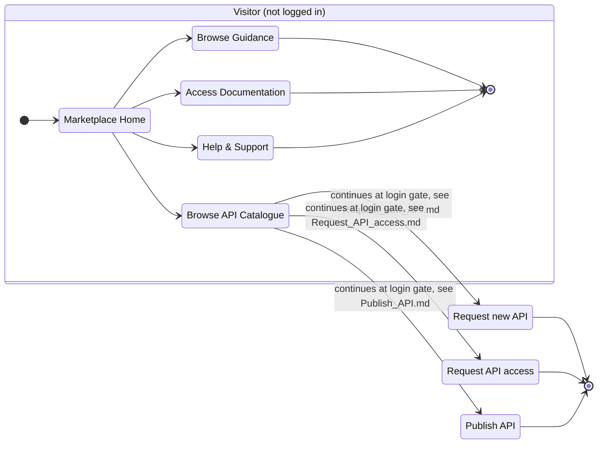

# Browse the Marketplace

```mermaid
stateDiagram-v2
    direction LR

    state "Visitor (not logged in)" as Visitor {
        [*] --> MarketplaceHome
        MarketplaceHome: Marketplace Home
        BrowseCatalogue: Browse API Catalogue
        BrowseGuidance: Browse Guidance
        AccessDocs: Access Documentation
        HelpSupport: Help & Support

        MarketplaceHome --> BrowseCatalogue
        MarketplaceHome --> BrowseGuidance
        MarketplaceHome --> AccessDocs
        MarketplaceHome --> HelpSupport

        BrowseGuidance --> [*]
        AccessDocs --> [*]
        HelpSupport --> [*]
    }

    RequestNewAPI: Request new API
    RequestAPIAccess: Request API access
    PublishAPI: Publish API

    BrowseCatalogue --> RequestNewAPI: continues at login gate, see Request_new_API.md
    BrowseCatalogue --> RequestAPIAccess: continues at login gate, see Request_API_access.md
    BrowseCatalogue --> PublishAPI: continues at login gate, see Publish_API.md

    RequestNewAPI --> [*]
    RequestAPIAccess --> [*]
    PublishAPI --> [*]
```
