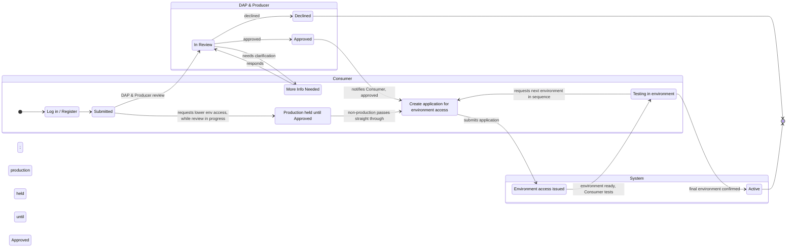

# Request API access

```mermaid
stateDiagram-v2
    direction LR

    state "Consumer" as ReqAccess_Consumer {
        [*] --> LoginGateAccess
        LoginGateAccess: Log in / Register
        SubmittedAccess: Submitted
        MoreInfoAccess1: More Info Needed
        ProductionGate: Production held until Approved
        CreateApplication: Create application for environment access
        TestingInEnvironment: Testing in environment
    }

    state "DAP & Producer" as ReqAccess_DAP {
        InReviewAccess: In Review
        ApprovedAccess: Approved
        DeclinedInitial: Declined
    }

    state "System" as ReqAccess_Sys {
        EnvironmentAccessIssued: Environment access issued
        Active: Active
    }

    LoginGateAccess --> SubmittedAccess
    SubmittedAccess --> InReviewAccess: DAP & Producer review
    InReviewAccess --> MoreInfoAccess1: needs clarification
    MoreInfoAccess1 --> InReviewAccess: responds
    InReviewAccess --> ApprovedAccess: approved
    InReviewAccess --> DeclinedInitial: declined
    DeclinedInitial --> [*]
    ApprovedAccess --> CreateApplication: notifies Consumer, approved

    SubmittedAccess --> ProductionGate: requests lower env access, while review in progress
    ProductionGate --> CreateApplication: non-production passes straight through; production held until Approved

    CreateApplication --> EnvironmentAccessIssued: submits application
    EnvironmentAccessIssued --> TestingInEnvironment: environment ready, Consumer tests
    TestingInEnvironment --> CreateApplication: requests next environment in sequence
    TestingInEnvironment --> Active: final environment confirmed
    Active --> [*]
```
