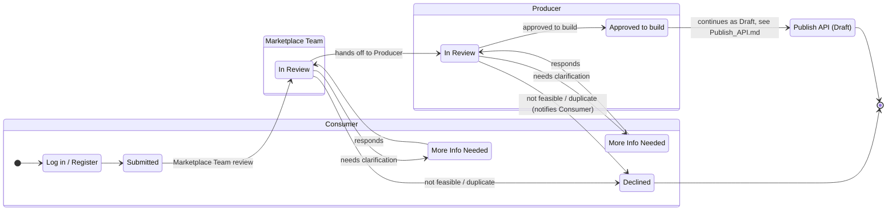

# Request new API

```mermaid
stateDiagram-v2
    direction LR

    state "Consumer" as ReqNew_Consumer {
        [*] --> LoginGateNew
        LoginGateNew: Log in / Register
        SubmittedNew: Submitted
        MoreInfoNew1: More Info Needed
        MoreInfoNew2: More Info Needed
        DeclinedNew: Declined
    }

    state "Marketplace Team" as ReqNew_MT {
        InReviewNewMT: In Review
    }

    state "Producer" as ReqNew_Producer {
        InReviewNewProducer: In Review
        ApprovedToBuild: Approved to build
    }

    PublishAPIDraft: Publish API (Draft)

    LoginGateNew --> SubmittedNew
    SubmittedNew --> InReviewNewMT: Marketplace Team review
    InReviewNewMT --> MoreInfoNew1: needs clarification
    MoreInfoNew1 --> InReviewNewMT: responds
    InReviewNewMT --> InReviewNewProducer: hands off to Producer
    InReviewNewMT --> DeclinedNew: not feasible / duplicate
    InReviewNewProducer --> MoreInfoNew2: needs clarification
    MoreInfoNew2 --> InReviewNewProducer: responds
    InReviewNewProducer --> DeclinedNew: not feasible / duplicate (notifies Consumer)
    InReviewNewProducer --> ApprovedToBuild: approved to build
    DeclinedNew --> [*]

    ApprovedToBuild --> PublishAPIDraft: continues as Draft, see Publish_API.md
    PublishAPIDraft --> [*]
```
