# Design: consumer and producer capabilities for the API Marketplace

| | |
|---|---|
| **Date** | 11 September 2026 (diagrams and flows added 15 September 2026; rewritten for clarity 15 September 2026) |
| **Status** | Draft — for review |
| **Requirements source** | MoSCoW list supplied by product owner, 11 September 2026 (verbatim requirements quoted below) |
| **Related** | [ADR 0002](../adr/0002-prototype-kit-with-static-export.md) · [ADR 0003](../adr/0003-authentication-and-identity.md) · [ADR 0005](../adr/0005-in-repo-api-catalogue.md) · [product-vision.md](../../archive/v0/product-vision.md) · CAP-01/05/06/07/09/10/13 ([`archive/v0/requirements/`](../../archive/v0/requirements/)) · existing product flows ([`design/flows/`](../flows/)) |

## Summary — read this first

The Marketplace is not one system, it's three, and that shapes almost every answer below:

1. **This website** — the catalogue, sign-in, "my applications", and (once built) "Try it".
2. **The Marketplace backend** — already signs people in. It's also designed to issue real sandbox
   test credentials automatically the instant someone registers an application — that part is
   coded, but not yet switched on for real users. See §1.5.
3. **The platform team's own system** — handles the two heavier actions: requesting real access to
   an API, and publishing a new one. This document does not redesign that system. It only says what
   this website needs to show or link to.

Of the 15 requirements below:

- **1 is already fully built and live** — requesting a brand-new API.
- **1 is coded but not yet switched on** — automatic sandbox credentials. The code exists and is
  merged, but three things outside this team's control haven't happened yet, so today the live site
  still hands out a fake key instead of a real one. See §1.5 for the as-is/to-be detail — this was
  confirmed by testing the live site directly, not assumed.
- **6 are small, self-contained additions** this team can build without waiting on anyone else.
- **4 depend on a small data change owned by a different team** (the shared API catalogue feed) —
  not something this team can finish alone, but easy once that change lands.
- **3 are correctly left for later** — they need something that doesn't exist yet anywhere (real
  usage statistics, or a directory of teams to route requests to), so building them now would mean
  guessing.

A one-line status table is in the [Quick reference](#quick-reference) below. Section 0 explains the
three-system split in more detail with a diagram. Sections 1 and 2 go through every requirement one
at a time, each with its own small diagram. Nothing here re-explains a process that's already
documented elsewhere — it links to it instead.

## Quick reference

| # | What's being asked for | Where things stand |
|---|---|---|
| 1.1 | Search and browse the catalogue; plain-English explanations | Mostly built — summaries need a small change to shared data |
| 1.2 | A step-by-step onboarding guide, with progress shown | Guide exists; showing progress needs a decision from another team |
| 1.3 | Test an API in a sandbox before integrating | Not built yet — plan below |
| 1.4 | See API availability and get support | Simple content addition |
| 1.5 | Self-service onboarding: automatic keys and emails | Coded, but switched off on the live site today — see §1.5 |
| 1.6 | Get notified when an API changes | Needs a decision from another team |
| 1.7 | Get help if stuck | Simple content addition |
| 1.8 | Request an API that doesn't exist yet | Already built |
| 2.1 | Clear publishing standards | Already built |
| 2.2 | A simple, one-form way to publish | Owned by another system |
| 2.3 | Tags showing an API's maturity (alpha/beta/live) | Needs a small change to shared data |
| 2.4 | Visibility when someone requests access | Owned by another system |
| 2.5 | See the whole API estate | Mostly covered by the existing catalogue |
| 2.6 | Usage analytics | Not possible yet — no source of that data exists |
| 2.7 | Consumer feedback | Small, new addition |

---

## 0. The three systems, and who owns what

Three separate systems share this product. Getting a requirement's owner wrong is the single
biggest risk to this design landing usefully, so every section below states which system owns it.

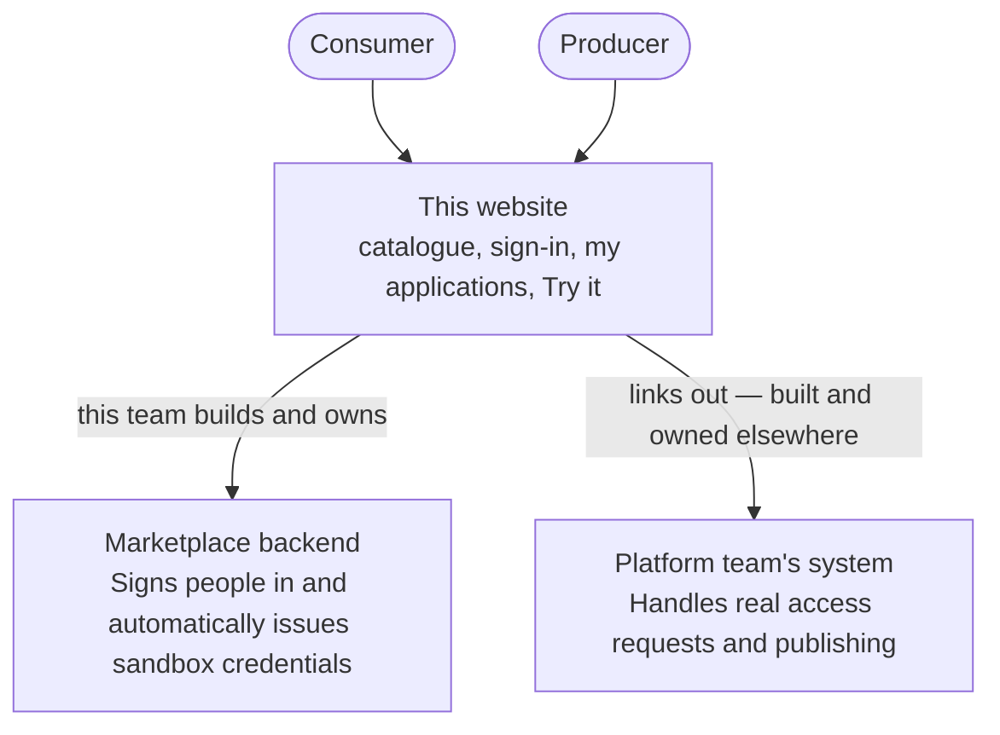

**How to read every diagram in this document:** a plain solid box is something this team builds and
owns. A dotted arrow labelled "see …" points to a process that's already fully documented elsewhere
— it isn't repeated here. A dotted box or arrow marked "not yet exposed" or "blocked" means the
thing it points to can't be built until something else (usually owned by another team) exists.

**In plain terms:**
- This website already sends people **away** to the platform team's system for the two big actions
  — "Request API access" and "Publish an API" — rather than handling them itself. Those two actions
  are out of this team's control. The platform team's own process for both is already written down
  in full: see [`design/flows/Request_API_access.md`](../flows/Request_API_access.md) and
  [`design/flows/Publish_API.md`](../flows/Publish_API.md).
- The one exception is "Request a new API" — asking for data that doesn't exist as an API yet. That
  one **is** handled by this team's own backend, and the full process is already written down in
  [`design/flows/Request_new_API.md`](../flows/Request_new_API.md).
- Sandbox credentials (the test Client ID and secret someone gets the moment they register an
  application) are **designed and coded, but not yet switched on**. Tested directly on the live
  site on 15 September 2026: registering a sandbox application today still hands back a made-up key
  and shows the application's own internal database ID as the "Client ID" — never a real one. See
  §1.5 for the as-is/to-be picture and exactly what's blocking the switch-over.
- Getting **production** (real, live) access is a bigger, more serious process, and it's also
  already fully documented: [`design/flows/Request_API_access.md`](../flows/Request_API_access.md)
  describes a joint review by the **DAP (Data Access Panel) and the Producer**, followed by a
  further review of each individual environment by the **Marketplace Team and Producer**, one
  environment at a time, until the consumer is fully live. This document does not redesign that
  process — only §1.2 and §1.5 touch it, and only to note what's still an open question.

*(Technical detail, for anyone implementing this: the website's own repository is
`hmcts-api-marketplace`; the Marketplace backend is `hmcts-api-marketplace-auth` (Node/Express +
Postgres, sandbox credential pool built in PR #12); the platform team's system is
`apim-marketplace-web`, on the Azure sandbox. Today the Marketplace backend runs on Render, an
unsanctioned host not approved for real credentials or production traffic — confirmed: production
hosting will be as pods on HMCTS's existing AKS estate instead, reusing the platform's own
cluster, CI/CD and operational tooling rather than standing up new infrastructure.)*

---

## 1. API viewers / consumers

### 1.1 Must have — "search and browse APIs simply and efficiently … understandable at a non-technical level"

> API catalogue searchable by a non-logged-in user. Ability for the API owner to provide a simple
> non-technical explanation. (Could have) a description of existing use cases.

**In short:** this already works. What's missing is a plain-English summary field and an optional
"how people use this" note — both need a small change to the shared catalogue data, not a new page.

**Owner:** this website. **Current state:** built — the catalogue can already be searched with no
sign-in needed, and every API has a detail page. See also
[`design/flows/Browse_the_Marketplace.md`](../flows/Browse_the_Marketplace.md) for the full
unauthenticated browse journey — this section only adds the two new fields below to it.

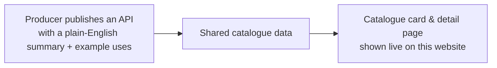

**Gap and design:**
- The shared catalogue data only carries a name, title, technical description and team — no
  plain-English summary distinct from the technical one, and no field for example use cases. This
  is a change to that shared data, owned by whoever publishes it — not something this team can add
  on its own. Two new optional fields are needed: a short plain-English summary (required when
  publishing — see §2.1) and a list of example use cases (optional).
- Once that field exists: the plain-English summary shows above the technical description on the
  detail page, always — if a producer hasn't filled it in yet, the page says so honestly rather
  than hiding the section or making something up.
- Example use cases show as a small expandable "See how this API is used" section when they exist,
  and don't show at all otherwise — a section with no real content is worse than no section.

### 1.2 Must have — "understand the onboarding process, with clear visibility on progress"

> A step-by-step guide on the onboarding process.

**In short:** the first four steps (get a sandbox test account working) are simple, fast, and this
team's own to build. Everything after "request real access" is a longer, more formal review already
run by other teams — this design shows where the handoff happens rather than re-describing that
review.

**Owner:** this website for the guide itself; the credential system (coded, not yet switched on —
see §1.5) for sandbox progress; [`design/flows/Request_API_access.md`](../flows/Request_API_access.md)
for production progress, which this team doesn't run.

**Current state:** a written guide already exists. There's no visual progress tracking for a
specific application yet.

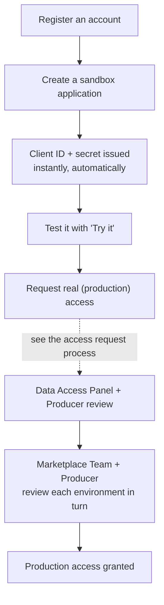

**Design:**
- Turn the existing guide into a numbered checklist matching the diagram above. The first four
  steps are entirely self-service and instant. Everything from "Request real access" onward belongs
  to the review process another team already runs and has documented — this design doesn't repeat
  it.
- "Clear visibility on progress" needs to show **where a specific application is right now**, not
  just a general guide. The sandbox steps are simple (created, then done — instantly), so the only
  part worth showing real progress for is the production review, and that review isn't run by this
  team.
- **Open question, not yet decided (see the open questions section):** can this website find out
  and show the actual stage of someone's production review — submitted, in review, approved, live —
  or is that entirely invisible to it today? Until that's answered, showing a progress bar here
  would mean inventing a status this team can't actually confirm, which this product has
  deliberately avoided doing anywhere else.

### 1.3 Must have — "interactive examples and sandbox environments so I can test APIs before integrating"

**In short:** not built yet, and it can't fully work until §1.5's real sandbox credentials are
actually switched on — "Try it" needs a genuine Client ID and secret to make a genuine call with.
Beyond that dependency, what's needed is a proxy step in the middle, because the secret needed to
make the call can never be sent to someone's browser.

**Owner:** this website (the screen) plus the real test environment (the actual call). Builds on
the *design* for automatic sandbox credentials (§1.5) and a working proof, done this session, that
the rest of the chain — logging in, calling the real test API with a token — works end to end. It
still needs §1.5's three blockers cleared before it can use real credentials rather than a proxy
built against them in isolation.

**Current state:** the "Try it" tab exists today but only shows example addresses — it doesn't make
a real call.

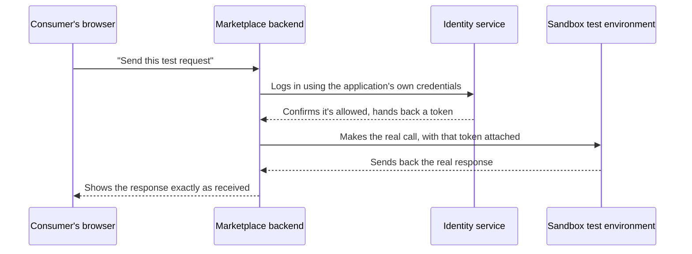

**Design:**
- "Try it" becomes real once an application already has sandbox credentials (§1.5): a form
  pre-filled with what the API expects, a way to choose which application to test with if someone
  has more than one, and a "Send request" button.
- The call **cannot happen directly from someone's browser** — the secret needed to make it must
  never be visible there. Instead, the website's own backend makes the call on the consumer's
  behalf, using the credentials it already holds for that application, and passes back exactly what
  it got — never a cleaned-up or reformatted version.
- This new step needs its own limit on how often it can be called per application, so it can't be
  used as an unmetered way to hammer the real test environment.

### 1.4 Must have — "visibility of availability of APIs and support available to me"

> (Could have) API usage dashboard. Signposting to HALO ITSM.

**In short:** a content addition, not a new feature — point people at the existing support channel
clearly and consistently. The usage dashboard needs data that doesn't exist yet anywhere this team
can read it, so it's correctly left for later.

**Owner:** this website, for the simple version. A real dashboard needs data this team doesn't
currently have (correctly a could-have, not designed further yet).

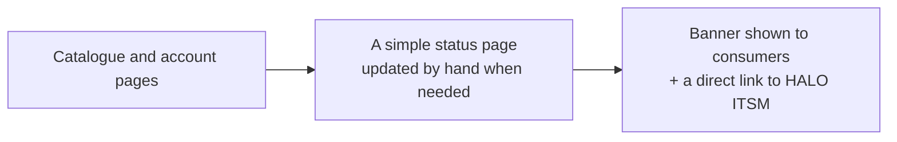

**Design:**
- Add a clear "Help and support" link plus a direct HALO ITSM link, and a small banner for known
  issues or planned maintenance, kept up to date by the marketplace team by hand. There's no live
  status feed to plug into today, and a fake one would be worse than an honestly hand-maintained
  banner.
- The usage dashboard needs real call-volume and error data that only the actual test/production
  environment has. Until that data is exposed somewhere this team (or the platform team) can read
  it, this stays out of scope — correctly, since it's marked could-have.

### 1.5 Must have — "onboarding process to be self-service with as little manual intervention as possible"

> Automated emails to DAP and API owners. Automated generation of API keys. (Could have) a progress
> bar per application.

**In short:** the automatic-credentials feature is designed and coded, but not switched on — tested
directly on the live site, it still hands out a made-up key today. Automatic email on this team's
own actions is small and easy to add once the credentials themselves are real. The email to the
Data Access Panel already happens as part of a review process owned elsewhere — nothing new needed
there.

**Owner:** the Marketplace backend. **Current state: as-is below is what the live site actually
does today (checked 15 September 2026); to-be is what's already coded and waiting to be switched
on.**

#### As-is — what the live site does today

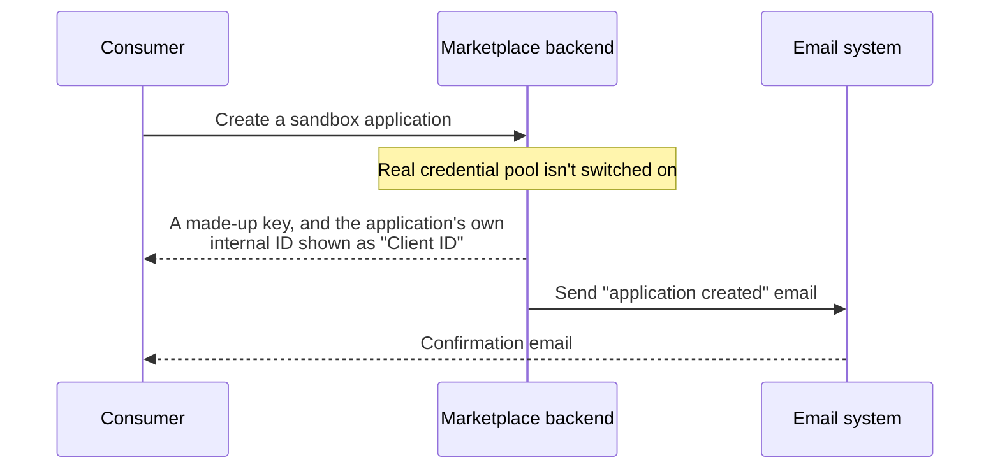

Verified by actually registering an application on the live site: the "API key" shown was a
made-up value (`amp_...`), and the "Client ID" on the application's own detail page was just its
internal database ID — not a real identifier anyone else would recognise. Anything built assuming
real credentials exist today would be building on top of this fake value.

#### To-be — the target design (already coded, not yet active)

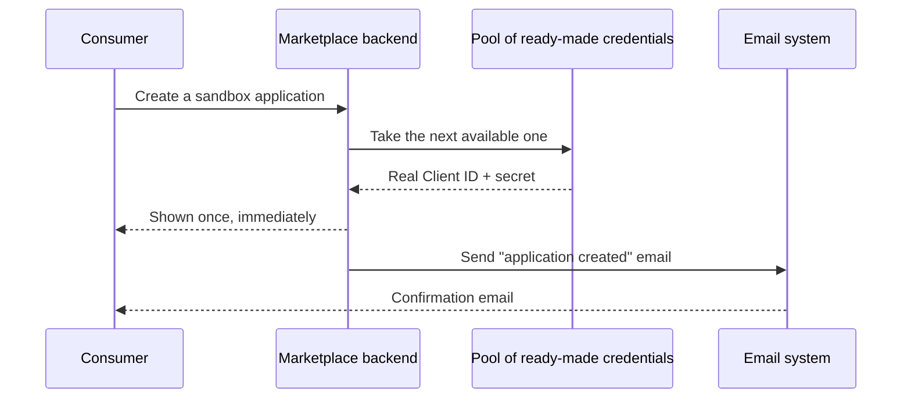

This is the actual target design, and the code for it already exists — it just isn't switched on.
**Three things outside this team's control are blocking it, in order:**
1. A separate change (already written and handed over, waiting to be applied) needs to create a
   batch of ready-to-use credentials ahead of time, and a narrow-permission identity that can read
   them. Neither exists yet.
2. Once that's applied, this team's own backend needs to be told where to find that identity's
   details — a small configuration change, but it can't happen before step 1.
3. The batch of ready-to-use credentials from step 1 then needs to be loaded into this team's own
   records — a one-off task, not yet built, and not worth building until step 1 exists to load from.

Until all three happen, the live site will keep handing out made-up keys — this isn't a bug in this
team's code, it's a dependency on other teams that hasn't been completed yet.

- **Automatic API keys — coded, not yet live.** Once the three steps above happen, creating a
  sandbox application will hand back a real, working Client ID and secret in the same response —
  no waiting, no manual step, no separate approval for sandbox access. That experience is already
  built; only the real credentials behind it are missing.
- **Automatic emails to API owners** on the real access-request/production path are already part of
  the review process owned by the platform team (see §0) — not something new for this team to
  build. What this team *should* add is a small, new thing: an email whenever one of **its own**
  actions happens — a sandbox application is created, its secret is rotated, or it's deleted. That's
  a small, contained addition using email sending already set up in the backend for other purposes.
- **"Automated emails … to DAP" — resolved.** DAP is the **Data Access Panel**, a real reviewing
  group named on the existing standards page. It's already part of the access-request review
  process run by the platform team. No new email needs building here — see §5 for where this was
  previously an open question.
- **Could-have progress bar** — see §1.2. The blocker is the same: there's nothing to show progress
  against until the open question about visibility into the production review is answered.

### 1.6 Must have — "notifications of any changes to APIs that I use"

**In short:** the idea is simple (email someone when an API they use changes) but nothing today
actually tells this system *when* that happens — that's the real gap, and it depends on another
team.

**Owner:** this website for the idea itself; whoever publishes the shared catalogue data for
actually knowing when something changed (nothing does today, only a static changelog).

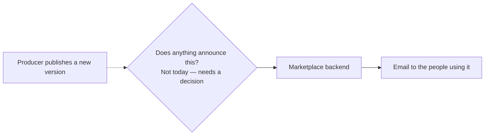

**Design:**
- A consumer effectively "follows" an API the moment they have an application connected to it —
  there's no need for a separate follow button, since this system already knows which APIs each
  application uses.
- **The real blocker:** nothing today tells this system the moment an API changes. Either the
  system that publishes API updates needs to actively announce it (the better option — genuinely
  self-service), or this system has to regularly check every API for changes itself (a working
  fallback, but less immediate and more effort to build).
- Once that's resolved, sending the actual email is the easy part — it reuses the same email
  sending already needed for §1.5.

### 1.7 Must have — "request help if I am stuck at any point"

**In short:** a small, consistent addition across every page — no new page or system needed.

**Owner:** this website. **Current state:** a contact page already exists and is honest about not
actually sending anything yet, by design.

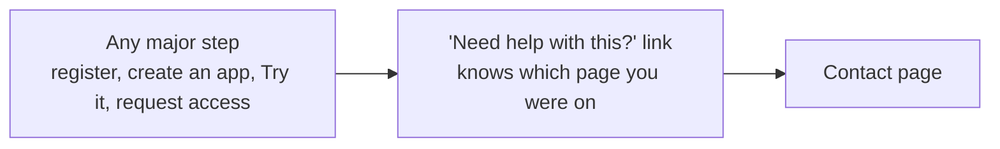

**Design:** the only real gap is making help easy to find at the exact moment someone gets stuck,
not building a new form. Every major step gets a small, consistent "Need help with this?" link that
carries through which page someone was on, so their question has context — a small, repeatable
pattern applied everywhere, not a new capability.

### 1.8 Should have — "request APIs for data that is currently not surfaced"

> (Could have) AI determining the correct team for these requests.

**In short:** already built, and the full review process behind it is already documented elsewhere.

**Owner:** this website. **Current state: built.** The form that asks for a new API already works,
and the full process after someone submits it — review, hand-off to the right producer, approval to
build — is already documented in
[`design/flows/Request_new_API.md`](../flows/Request_new_API.md).

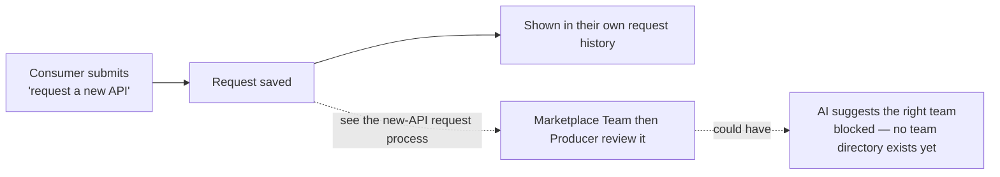

**Could-have — AI routing:** automatically working out "the correct team" needs a real, structured
list of teams and what they own, which doesn't exist anywhere in this system today. Guessing with AI
without that list would produce a plausible-looking but potentially wrong answer — worse than a
person currently doing that triage. Correctly left for later, until a real team directory exists to
check against.

---

## 2. API producers

### 2.1 Must have — "understand the technical requirements to list an API / data product"

> Clear standards set out on a page on the website.

**In short:** already built.

**Owner:** this website. **Current state: built** — a standards page already exists.

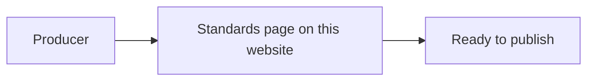

**Design addition:** the new plain-English-summary and example-use-cases fields from §1.1 need to
be added to this standards page — the summary as required, the use cases as optional — alongside
whatever technical rules already live there.

### 2.2 Must have — "the process to list my API to be as simple as possible"

> One form to complete to automatically add content to the catalogue. Ability to edit/provide an
> update if there is a new version.

**In short:** this whole process already belongs to the platform team's own publishing tool, fully
documented. This team's part is only making sure the catalogue reflects it once it's live.

**Owner:** the platform team's system, already linked to from this website. The full review process
— draft, review, listed — is documented in
[`design/flows/Publish_API.md`](../flows/Publish_API.md). This team's own part is the standards
content (§2.1) and making sure the catalogue reflects whatever gets published.

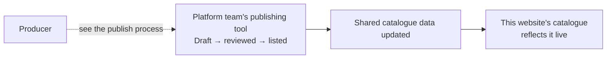

**Design (this team's side only):**
- Nothing to build for the form or the review process — both belong to the platform team's system
  already.
- "Ability to edit / provide an update" needs the shared catalogue data to carry version history,
  which it doesn't reliably yet. Once it does, the changelog tab shows it; until then, it stays
  empty rather than inventing a history.

### 2.3 Must have — "govern and advertise the API lifecycle so consumers understand maturity levels"

> Ability to add tags to each API.

**In short:** a small addition to the shared catalogue data plus a coloured tag on the catalogue —
the same kind of change as §1.1.

**Owner:** whoever publishes the shared catalogue data, plus this website's rendering. **Current
state:** data-sensitivity labels already exist (Official/Official-Sensitive/Restricted); a
separate "how mature is this API" label (alpha/beta/live/deprecated) does not yet.

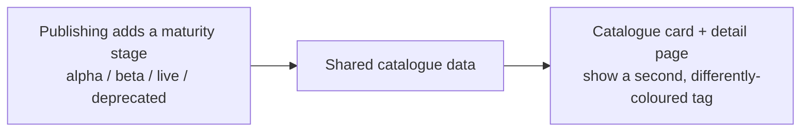

**Design:** add a maturity field when publishing (the same kind of change as §1.1 and §2.2 — owned
elsewhere, not something this team can add alone), shown as a second tag using GOV.UK's own colour
conventions (grey/blue/green/red) so it's understandable without needing a separate legend.

### 2.4 Must have — "visibility of any integrations"

> Emails sent to API owner when access is requested. (Could have) API dashboard to see usage
> patterns from consumers.

**In short:** this is already handled by the access-request review process owned by another team.

**Owner:** the platform team's system, as part of the review process already documented in
[`design/flows/Request_API_access.md`](../flows/Request_API_access.md). Not something this team
builds.

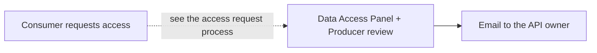

**Could-have dashboard:** same blocker as §1.4 — needs real usage data this team doesn't have
access to. Correctly left for later.

### 2.5 Must have — "visibility of the HMCTS API estate"

**In short:** the existing public catalogue already mostly covers this — a producer browses it the
same way a consumer does.

**Owner:** this website, using the same catalogue browsing experience consumers already use.

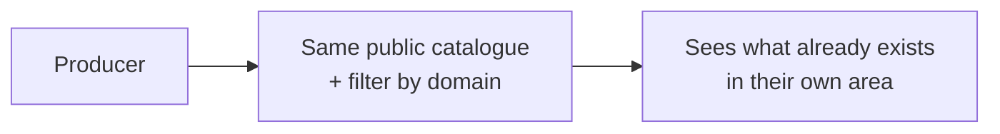

**Design:** no new page needed — just make sure the existing domain filter is good enough for a
producer to check "does something like this already exist" before building a duplicate. Whether
producers also need to see APIs that *aren't* public yet (still in review, or retired) is a
genuinely open question, not something assumed here.

### 2.6 Could have — "analytics on API usage, performance, and consumer adoption"

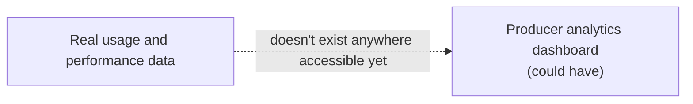

Same gap as §1.4/§2.4 — this needs real usage data that isn't available from anywhere today.
Correctly left for later.

### 2.7 Could have — "receive feedback from consumers"

**In short:** small and self-contained — a simple form and a simple list, nothing more.

**Owner:** this website.

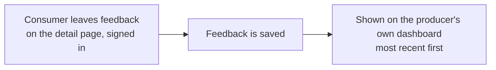

**Design:** a simple feedback box on the detail page, available to anyone signed in — not just
people with a connected application. Shown to the producer as a plain list, most recent first, with
no analysis or scoring beyond that — nothing here justifies more than a simple list yet.

---

## 3. A few decisions that apply across several requirements

- **Roles.** Every producer-facing feature above reuses the roles this system already has (owner,
  administrator, developer) rather than inventing a separate "producer" role — a producer is simply
  someone who owns or administers an entry, the same shape as a consumer.
- **Email.** Every notification this team actually owns (§1.5, §1.6) reuses the same email-sending
  already set up in the backend. One well-tested way of sending an email, used everywhere it's
  needed, rather than several different ones. The Data Access Panel and API-owner email on the
  access-request path (§1.5, §2.4) is separate, and owned by the platform team's own process.
- **Data owned outside this team.** §1.1, §2.2 and §2.3 all depend on a small addition to the
  shared catalogue data that comes from elsewhere. None of them can be finished by this team alone
  — but this document says exactly what's needed so that work can be requested precisely.
- **Don't repeat what's already written down.** Four processes are already fully documented
  elsewhere: browsing the marketplace, publishing an API, requesting API access, and requesting a
  new API. Every relevant section above links to the right one instead of describing it again — this
  document only adds what those don't already cover.

## 4. Build order

| # | Requirement | Owner | Status | Effort once ready |
|---|---|---|---|---|
| 1.5 | Automatic sandbox credentials | Marketplace backend + 2 other teams | Coded, blocked on 3 external steps (§1.5) | Small, once unblocked |
| 1.8 | Request a new API | this website | **Done** | — |
| 1.1 | Plain-English summaries + use cases | Shared catalogue data + this website | Waiting on a data change | Small, once ready |
| 2.3 | Maturity tags | Shared catalogue data + this website | Waiting on a data change | Small, once ready |
| 1.3 | Live "Try it" | This website + backend | Not started — also needs §1.5 unblocked first | Medium |
| 1.5 | Emails for this team's own actions | Marketplace backend | Not started | Small |
| 1.7 | "Need help" links | This website | Not started | Small |
| 1.4 | Support/status banner | This website | Not started | Small |
| 1.2 | Onboarding guide as a checklist | This website | Not started | Small |
| 1.6 | Change notifications | This website + shared catalogue data | Waiting on a decision | Depends on the decision |
| 2.7 | Consumer feedback | This website | Not started | Small |
| 1.2/1.5 | Per-application progress view | This website + platform team | Waiting on a decision | Depends on the decision |
| 1.4, 2.4, 2.6 | Usage dashboards, analytics | Needs real usage data | Not possible yet | Large, later |
| 1.8 | AI request routing | Needs a team directory | Not possible yet | Later, once a directory exists |
| 2.2 | Publish/edit an API | Platform team | Owned elsewhere | Not this team's work |
| 2.4 | Access-request + Data Access Panel emails | Platform team | Owned elsewhere | Not this team's work |

## 5. Corrections to existing documentation

- An older document (`CAP-09-credentials.md`) still says sandbox credentials are "not built" and
  depend on a real backend. That's partly out of date — the feature (issue instantly, show once,
  list, rotate, revoke) is fully coded — but partly still accurate: it isn't switched on for real
  users yet. See §1.5 for the precise as-is/to-be picture, confirmed by testing the live site
  directly rather than assumed from the code.
- An earlier version of this document asked "who is DAP?" as an open question. Resolved: DAP is the
  **Data Access Panel**, a real reviewing group named on the existing standards page, already part
  of the platform team's access-request review — see §1.5.
- An earlier version of this document itself stated sandbox credentials were "real and already
  working." That was wrong — it was true of the code, not of what the live site actually does.
  Corrected throughout this version, and in §1.5 specifically, after testing the live site directly
  on 15 September 2026 rather than relying on the code alone.

## 6. Open questions

1. Can this website find out and show the real stage of someone's production access request
   (submitted / in review / approved / live), or is that entirely invisible to it today? This
   decides whether §1.2 and §1.5's progress view is possible at all.
2. When a producer publishes a new version of an API, does anything announce that anywhere this
   system could detect it — or would this system have to regularly check every API itself?
3. Do producers need to see APIs that aren't public yet (in review, or retired), or does the
   existing public catalogue already answer "visibility of the estate" as asked?
